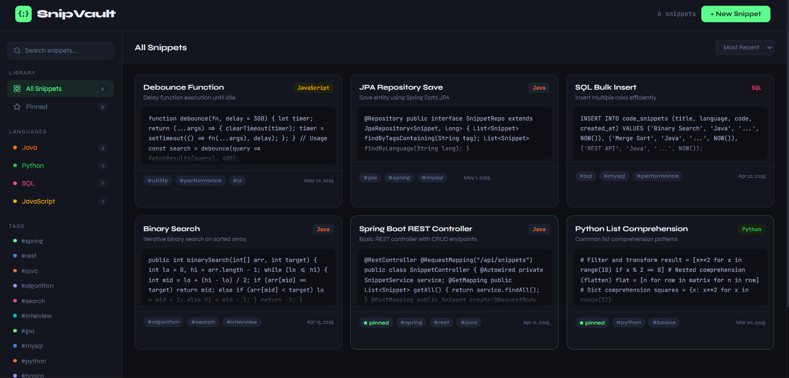

# 🗂️ Developer Code Snippet Manager


A full-stack application for developers to **store, organize, and retrieve reusable code snippets** through REST APIs.

Built with **Java Spring Boot** backend and a clean **HTML/CSS/JS** frontend, served as a static resource.

---

## 🛠️ Tech Stack

| Layer | Technology |
|-------|-----------|
| Backend | Java 17, Spring Boot 3.2 |
| ORM | Spring Data JPA + Hibernate |
| Database | MySQL |
| API Style | RESTful APIs |
| Frontend | HTML5, CSS3, Vanilla JS |

---

## ✨ Features

- ✅ Full **CRUD** operations for code snippets
- 🔍 **Search** by keyword across titles
- 🏷️ **Tag-based filtering** for efficient retrieval
- 🌐 **Language filtering** (Java, Python, SQL, etc.)
- 📌 **Pin** important snippets
- 📦 **Batch import** via `/api/snippets/bulk` endpoint
- 🖥️ Responsive frontend UI

---

## 🚀 Run Locally

### Prerequisites
- Java 17+
- Maven
- MySQL

### Steps

**1. Clone the repository**
```bash
git clone https://github.com/YOUR_USERNAME/developer-code-snippet-manager.git
cd developer-code-snippet-manager
```

**2. Create the database**
```sql
CREATE DATABASE snippetdb;
```

**3. Update credentials**

Edit `src/main/resources/application.properties`:
```properties
spring.datasource.username=root
spring.datasource.password=YOUR_PASSWORD
```

**4. Run the app**
```bash
mvn spring-boot:run
```

**5. Open in browser**
```
http://localhost:8080
```

---

## 📡 API Endpoints

| Method | Endpoint | Description |
|--------|----------|-------------|
| `GET` | `/api/snippets` | Get all snippets |
| `GET` | `/api/snippets/{id}` | Get snippet by ID |
| `POST` | `/api/snippets` | Create new snippet |
| `PUT` | `/api/snippets/{id}` | Update snippet |
| `DELETE` | `/api/snippets/{id}` | Delete snippet |
| `GET` | `/api/snippets/search?kw=` | Search by keyword |
| `GET` | `/api/snippets/filter/tag?tag=` | Filter by tag |
| `GET` | `/api/snippets/filter/lang?lang=` | Filter by language |
| `GET` | `/api/snippets/pinned` | Get pinned snippets |
| `POST` | `/api/snippets/bulk` | Bulk import (batch processing) |

---

## 📬 Example API Request

**Create a snippet:**
```json
POST /api/snippets
{
  "title": "Binary Search",
  "language": "Java",
  "description": "Iterative binary search on sorted array",
  "code": "public int binarySearch(int[] arr, int target) { ... }",
  "tags": ["algorithm", "search", "interview"],
  "pinned": false
}
```

**Bulk import:**
```json
POST /api/snippets/bulk
[
  { "title": "Snippet 1", "language": "Java", "code": "..." },
  { "title": "Snippet 2", "language": "Python", "code": "..." }
]
```

---

## 🗂️ Project Structure

```
src/
├── main/
│   ├── java/com/gokul/snippetmanager/
│   │   ├── SnippetManagerApplication.java
│   │   ├── controller/SnippetController.java
│   │   ├── service/SnippetService.java
│   │   ├── repository/SnippetRepository.java
│   │   └── model/Snippet.java
│   └── resources/
│       ├── application.properties
│       └── static/
│           ├── index.html       ← Frontend UI
│           └── api.js           ← API service
└── test/
    └── java/com/gokul/snippetmanager/
        └── SnippetManagerApplicationTests.java
```

---

## 👨‍💻 Author

**Gokul Prasad**  
Computer Science Graduate — Providence College of Engineering, Chengannur  
📧 gokulprasad497@gmail.com
